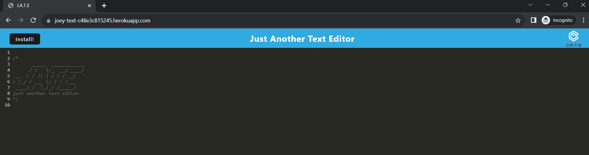

# Text Editor
```
Heroku link:
https://joey-text-c48e3c815245.herokuapp.com/

Github repo:
https://github.com/Thaodev23/text-editor
```

## User Story
```
AS A freelance web development employee
I WANT to make a text editor on a webpage
SO THAT I can take down important notes for later uses
```

## Acceptance Criteria
```
GIVEN I made a text editor on a webpage
WHEN I run the command npm start
THEN the webpage application will start up
WHEN I access the webpage application after run the npm command
THEN I will be able to gain access to the text editor webpage
WHEN I deploy the application to Heroku
THEN the application should appear on Heroku
```

## Image

Below: Image of the text editor webpage application. 



## References

Used most of the file structure from Gary Almes'(instructor) unit 19 PWA Github repo. The file structure was modified to match the requirement of 
homework 19. 

## Collaborators

```
Jason Yang:
Github profile - https://github.com/Jasony95
Classmate that collaborated on the homework assignment together.
 ```

```
Sichoun Nplhaib Lee:
Github profile - https://github.com/DDXP3.
Classmate that collaborated on the homework assignment together.
```


